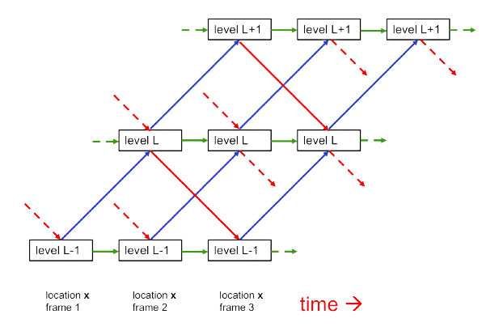
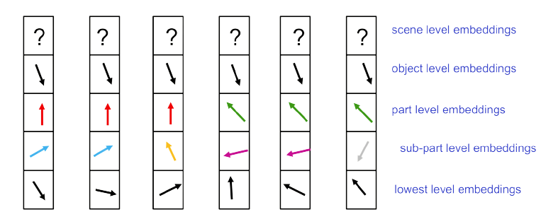

# GLOM TensorFlow [](https://twitter.com/intent/tweet?text=Wow:&url=https%3A%2F%2Fgithub.com%2FRishit-dagli%2FGLOM-TensorFlow)


[](https://github.com/Rishit-dagli/GLOM-TensorFlow/actions/workflows/flake8-lint.yml)
[](https://github.com/Rishit-dagli/GLOM-TensorFlow/actions/workflows/python-publish.yml)


[](LICENSE)
[](https://www.python.org/dev/peps/pep-0008/)
[](https://github.com/Rishit-dagli/GLOM-TensorFlow/stargazers)
[](https://github.com/Rishit-dagli)
[](https://twitter.com/intent/follow?screen_name=rishit_dagli)

This Python package attempts to implement GLOM in TensorFlow, which allows advances made by several different groups 
transformers, neural fields, contrastive representation learning, distillation and capsules to be combined. This was 
suggested by Geoffrey Hinton in his paper 
["How to represent part-whole hierarchies in a neural network"](https://arxiv.org/abs/2102.12627).

Further, [Yannic Kilcher's video](https://youtu.be/cllFzkvrYmE) and [Phil Wang's repo](https://github.com/lucidrains/glom-pytorch)
was very helpful for me to implement this project.

## Installation

Run the following to install:

```shell script
pip install glom-tf
```

## Developing `glom-tf`

To install `glom-tf`, along with tools you need to develop and test, run the following in your virtualenv:

```shell script
git clone https://github.com/Rishit-dagli/GLOM-TensorFlow.git
# or clone your own fork

cd GLOM-TensorFlow
pip install -e .[dev]
```

## A bit about GLOM

The GLOM architecture is composed of a large number of columns which
all use exactly the same weights. Each column is a stack of spatially local
autoencoders that learn multiple levels of representation for what is happening
in a small image patch. Each autoencoder transforms the embedding at one level
into the embedding at an adjacent level using a multilayer bottom-up encoder
and a multilayer top-down decoder. These levels correspond to the levels in a
part-whole hierarchy.


<p align="center">
<small>Interactions among the 3 levels in one column</small>
</p>

An example shared by the author was as an example when show a face image, a single column might converge on embedding 
vectors representing a nostril, a nose, a face, and a person.

At each discrete time and in each column separately, the embedding at a
level is updated to be the weighted average of:
- bottom-up neural net acting on the embedding at the level below at the previous time
- top-down neural net acting on the embedding at the level above at the previous time
- embedding vector at the previous time step
- attention-weighted average of the embeddings at the same level in nearby columns at the previous time

For a static image, the embeddings at a level should settle down over time to produce similar vectors.


<p align="center">
<small>A picture of the embeddings at a particular time</small>
</p>

## Usage

```python
from glomtf import Glom

model = Glom(dim = 512,
             levels = 5,
             image_size = 224,
             patch_size = 14)

img = tf.random.normal([1, 3, 224, 224])
levels = model(img, iters = 12) # (1, 256, 5, 12)
# 1 - batch
# 256 - patches
# 5 - levels
# 12 - dimensions
```

Use the `return_all = True` argument to get all the column and level states per iteration. This also gives you access 
to all the level data across iterations for clustering, from which you can inspect the islands too.

```python
from glomtf import Glom

model = Glom(dim = 512,
             levels = 5,
             image_size = 224,
             patch_size = 14)

img = tf.random.normal([1, 3, 224, 224])
all_levels = model(img, iters = 12, return_all = True) # (13, 1, 256, 5, 12)
# 13 - time

# top level outputs after iteration 6
top_level_output = all_levels[7, :, :, -1] # (1, 256, 512)
# 1 - batch
# 256 - patches
# 512 - dimensions
```

## Citations

```bibtex
@misc{hinton2021represent,
    title   = {How to represent part-whole hierarchies in a neural network}, 
    author  = {Geoffrey Hinton},
    year    = {2021},
    eprint  = {2102.12627},
    archivePrefix = {arXiv},
    primaryClass = {cs.CV}
}
```
